## Spotify – Frontend

## Descrição

Interface web inspirada no Spotify, construída com React + Vite + TailwindCSS e integrada à Spotify Web API e ao Web Playback SDK. Permite autenticação, navegação por artistas/álbuns/playlists, busca, gerenciamento de playlists e reprodução de faixas diretamente no navegador.

## Deploy

https://spotify-frontend-zeta-blue.vercel.app/login


## Sonar

https://sonarcloud.io/project/overview?id=pefelippe_spotify-frontend

## Funcionalidades

- Autenticação via Spotify (OAuth) com fluxo de callback
- Home com banner de boas-vindas, playlists do usuário, tocadas recentemente e seção “Seus Artistas Favoritos” (até 10 artistas)
- Busca com prévia de resultados e histórico de buscas recentes
- Artistas: listagem, detalhes, top músicas e discografia (álbuns e singles)
- Álbuns: detalhes, tracklist e reprodução em contexto
- Playlists: criar, editar, apagar, adicionar/remover faixas e adicionar música a playlists
- Músicas Curtidas: visualização das faixas curtidas pelo usuário
- Player integrado: modos compacto e expandido, controles, barra de progresso, seleção de dispositivos e aviso para contas não‑Premium
- Listas com scroll infinito e seções em carrossel
- PWA: instalação e suporte offline básico (quando disponível)
- Layout responsivo para desktop e mobile

## Tecnologias

- React 19 + React Router
- Vite 7
- TypeScript 5
- TailwindCSS 3
- TanStack React Query 5 (cache, infinite queries)
- Axios
- Spotify Web API + Web Playback SDK
- Testing Library + Vitest (unitários)
- Playwright (E2E)
- ESLint + Prettier
- PWA (via `vite-plugin-pwa`)

## Screens

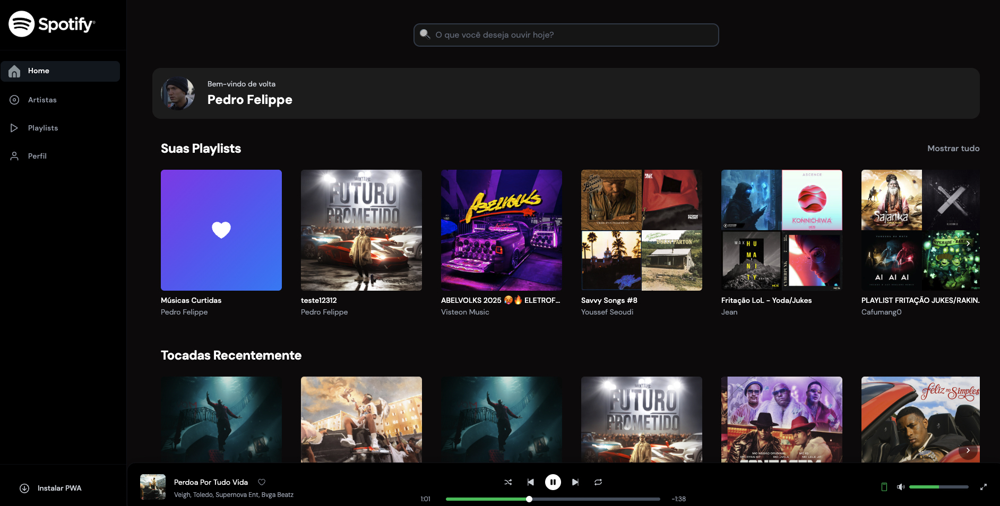
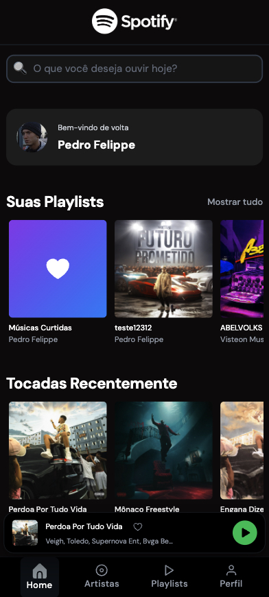

## Player Expandido


## Login

[Login no deploy](https://spotify-frontend-zeta-blue.vercel.app/login)

## Álbum

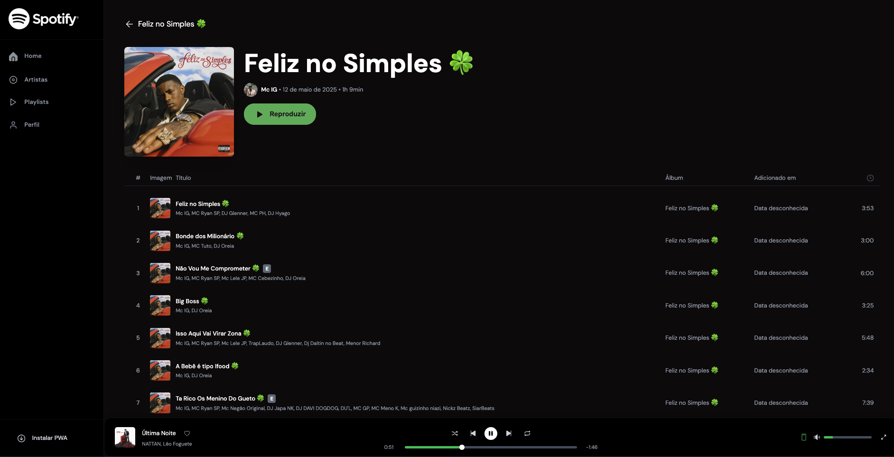

## Perfil

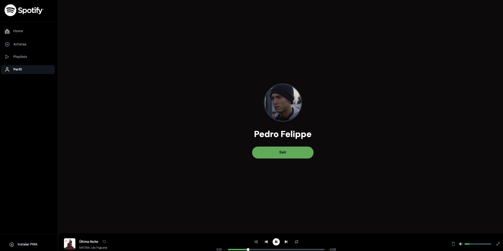

## Playlists

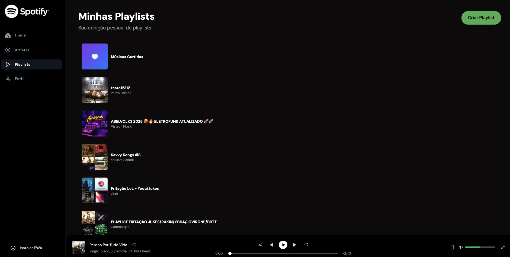
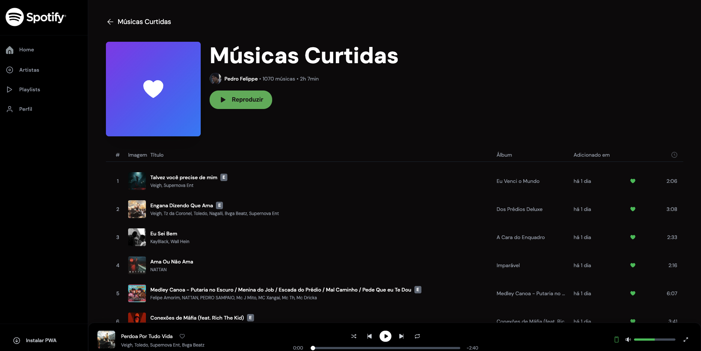
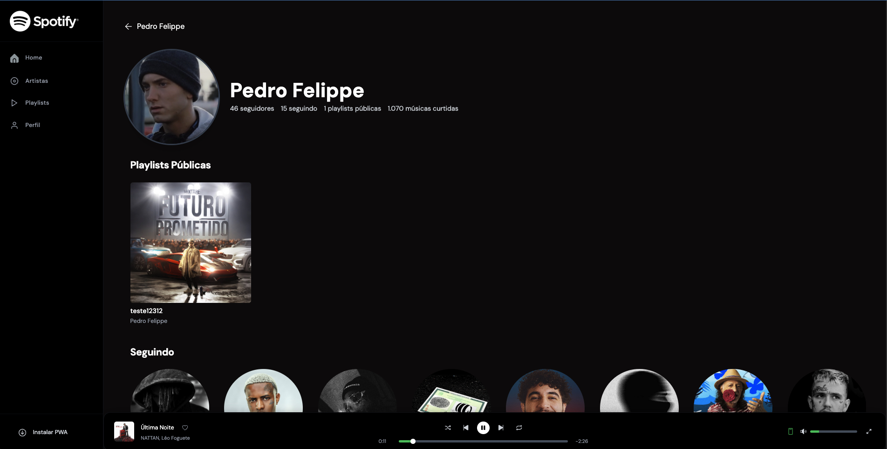

## Criar Playlist

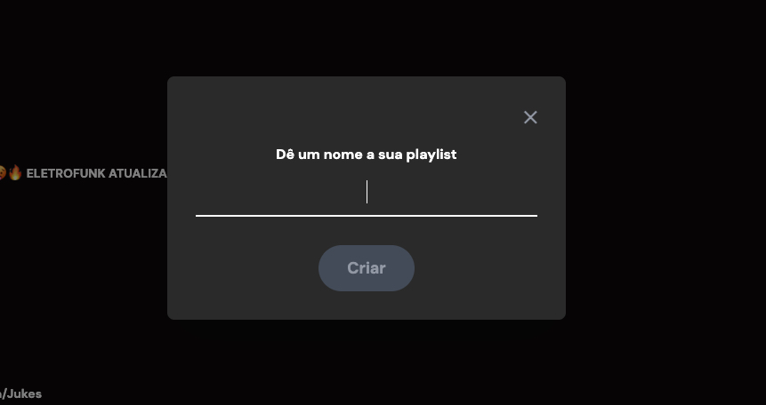

## Artistas

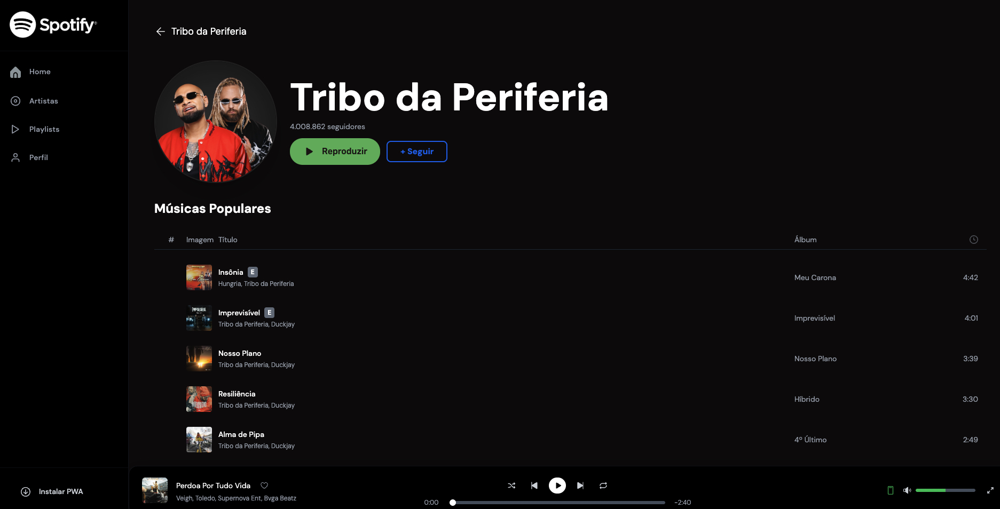
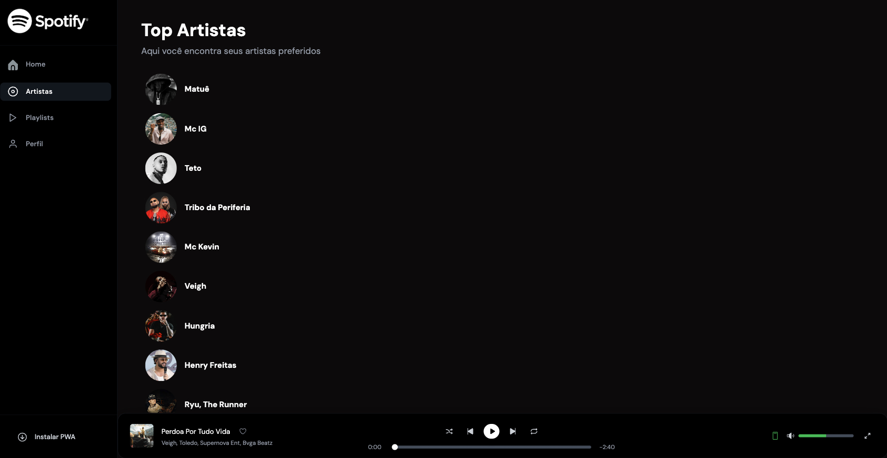

## Busca

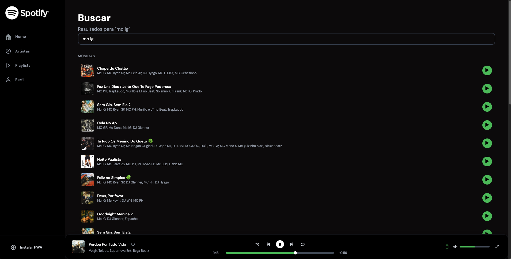
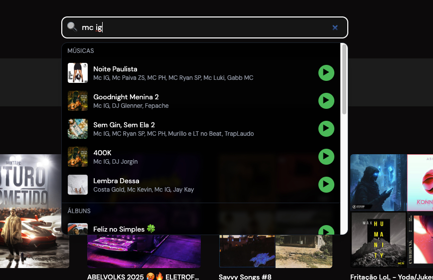
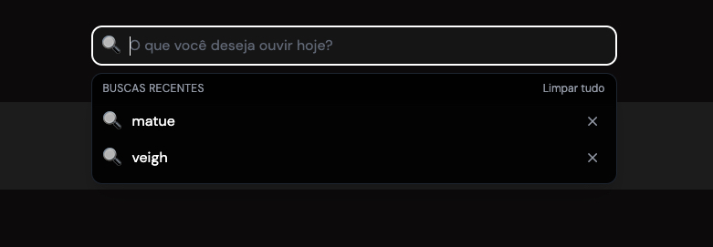

---

### Como começar

#### Pré-requisitos

- Node.js 18+ e Yarn
- Credenciais da API do Spotify (Client ID/Secret) e uma Redirect URI configurada no Spotify Developer Dashboard

#### 1) Instalar dependências

```bash
yarn
```

#### 2) Variáveis de ambiente

Crie um arquivo `.env.local` (ou utilize seu fluxo de env preferido) e defina os valores. Exemplo:

```bash
VITE_API_URL=<url do backend>
```

#### 3) Executar em desenvolvimento

```bash
yarn dev
```

Aplicação disponível em:

```
http://localhost:5173
```

#### 4) Build e Preview

```bash
yarn build
yarn preview
```

#### 5) Testes e Lint

```bash
# Testes unitários (Vitest)
yarn test

# Testes E2E (Playwright)
yarn test:e2e
# UI dos testes E2E (opcional)
yarn test:e2e:ui
# Relatório HTML do Playwright
yarn test:e2e:report

# Lint
yarn lint
```

---

### Scripts úteis

- `yarn dev`: inicia o servidor de desenvolvimento (Vite)
- `yarn build`: compila o app para produção
- `yarn preview`: pré-visualiza o build de produção
- `yarn test`: executa os testes unitários (Vitest)
- `yarn test:e2e`: executa os testes end-to-end (Playwright)
- `yarn test:e2e:ui`: abre a interface do Playwright Test
- `yarn test:e2e:report`: abre o relatório HTML mais recente
- `yarn lint`: roda o ESLint

---

### Notas de desenvolvimento

- Reprodução (Playback): utiliza Spotify Web Playback SDK + Web API. É necessária uma conta Spotify Premium para controlar a reprodução via Web SDK.
- HTTPS (opcional): alguns navegadores/dispositivos exigem HTTPS para determinados recursos.
  - Caminho mais simples: `vite-plugin-mkcert` ou túnel (ex.: `ngrok`).
- PWA: o app registra um Service Worker quando servido em HTTPS (ou localhost) para oferecer experiência instalável/offline básica.

### Solução de problemas

- A reprodução não inicia:
  - Garanta que você está autenticado, possui um dispositivo ativo e que a conta é Premium.
  - Abra o aplicativo Spotify em qualquer dispositivo para “ativar” um device e, então, selecione-o no app (se aplicável).

---

### Licença

Projeto para fins educacionais/demonstração. Verifique os Termos de Desenvolvedor do Spotify antes de ir para produção.
