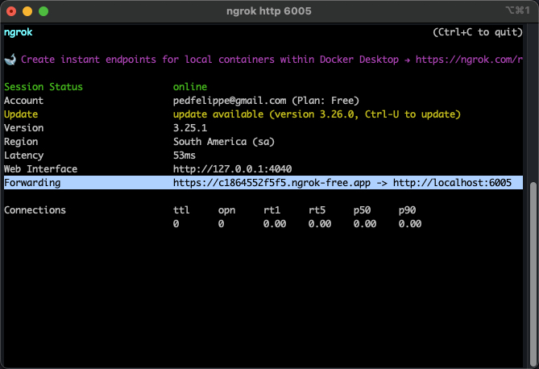
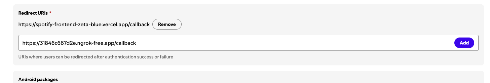
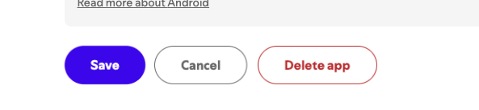

## Spotify – Frontend

## Descrição

Interface web inspirada no Spotify, construída com React + Vite + TailwindCSS e integrada à Spotify Web API e ao Web Playback SDK. Permite autenticação, navegação por artistas/álbuns/playlists, busca, gerenciamento de playlists e reprodução de faixas diretamente no navegador (para contas premium).

# 🚧🚧🚧 AVISO IMPORTANTE 🚧🚧🚧🚧

O app está registrado como "development mode".

Isso quer dizer que qualquer conta pode se autenticar com a Spotify API, porém todas as requests serão bloqueadas. Para resolver isso, eu preciso manualmente adicionar o seu spotify e-email no dashboard do app.

Para isso, por favor me envie uma mensagem com o seu-email para 📧 pedfelippe@gmail.com.

Além disso, o app fica muito mais interessante se você usar uma conta premium :)

## Deploy

https://spotify-frontend-zeta-blue.vercel.app/login

## Sonar

https://sonarcloud.io/project/overview?id=pefelippe_spotify-frontend

## Funcionalidades

- Autenticação via Spotify (OAuth) com fluxo de callback
- Home com banner de boas-vindas, playlists do usuário, tocadas recentemente e seção “Seus Artistas Favoritos” (até 10 artistas)
- Busca com prévia de resultados e histórico de buscas recentes
- Artistas: listagem, detalhes, top músicas e discografia (álbuns e singles)
- Álbuns: detalhes, tracklist e reprodução em contexto
- Playlists: criar, editar, apagar, adicionar/remover faixas e adicionar música a playlists
- Músicas Curtidas: visualização das faixas curtidas pelo usuário
- Player integrado: modos compacto e expandido, controles, barra de progresso, seleção de dispositivos e aviso para contas não‑Premium
- Listas com scroll infinito e seções em carrossel
- PWA: instalação e suporte offline básico (quando disponível)
- Layout responsivo para desktop e mobile

## Tecnologias

- React 19 + React Router
- Vite 7
- TypeScript 5
- TailwindCSS 3
- TanStack React Query 5 (cache, infinite queries)
- Axios
- Spotify Web API + Web Playback SDK
- Testing Library + Vitest (unitários)
- Playwright (E2E)
- ESLint + Prettier
- PWA (via `vite-plugin-pwa`)

## Screens


## Player Expandido


## Login

[Login no deploy](https://spotify-frontend-zeta-blue.vercel.app/login)

## Álbum


## Perfil


## Playlists


## Criar Playlist


## Artistas


## Busca


---

### Executando localmente

#### Pré-requisitos

- Node.js 18+ e Yarn
- Backend rodando e acessível (padrão: `http://localhost:3001`)
- `ngrok` (o Spotify não aceita `localhost` como Redirect URI)
- Um app criado no [Spotify Developer Dashboard](https://developer.spotify.com/dashboard)

#### 1) Instalar dependências

```bash
yarn
```

#### 2) Variáveis de ambiente (frontend)

Crie um arquivo `.env.local` com:

```bash
VITE_API_URL=http://localhost:3001
```

Observação: se não informar, o frontend usará `http://localhost:3001` por padrão.

#### 3) Subir o frontend

```bash
yarn dev
```

Aplicação disponível em `http://localhost:5173`.

#### 4) Expor o frontend via HTTPS (ngrok)

Em outra aba/terminal:

```bash
ngrok http 5173
```

Copie a URL de Forwarding (ex.: `https://abcd-1234.ngrok-free.app`).



#### 5) Configurar Redirect URI no app do Spotify

No Dashboard, adicione a Redirect URI apontando para o seu frontend:

- `https://SEU_SUBDOMINIO.ngrok-free.app/callback`




#### 6) Backend

- Garanta que o backend esteja configurado com as credenciais do Spotify e as URLs corretas.
- Inicie o backend.

#### 7) Fazer login

Abra a URL pública do ngrok e vá para `/login`, por exemplo:

```
https://SEU_SUBDOMINIO.ngrok-free.app/login
```

### Build e Preview

```bash
yarn build
yarn preview
```

### Testes

```bash
yarn test
yarn test:e2e
yarn test:e2e:ui
yarn test:e2e:report

# Lint
yarn lint
```
